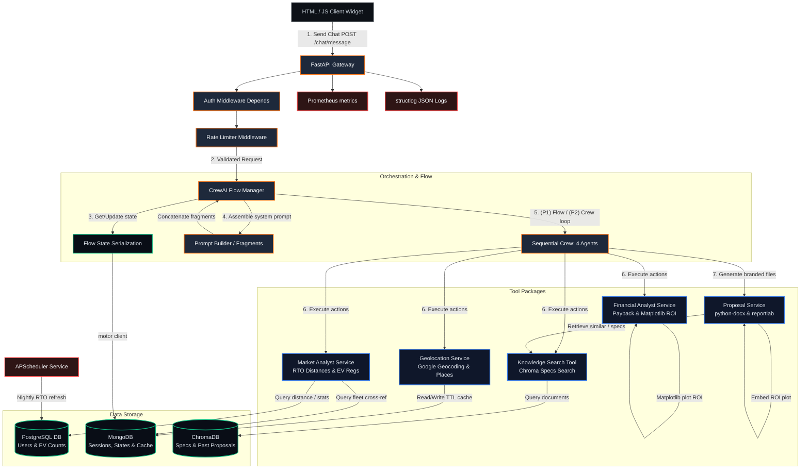

# SalesAI — Enterprise Site-Feasibility & Proposal Architecture

This document describes the design, pipeline flow, and technical modules of **SalesAI**, ChargeMOD's agentic chatbot for site-feasibility assessment and branded proposal generation.

---

## 🎨 Visual System Architecture Diagram

The visual diagram showcases the interaction between the API Gateway, auth/rate-limiting middlewares, CrewAI orchestrator flow, tool registry integrations, persistent database systems, and background scheduling.

---

## 📊 Detailed System flow (Mermaid)

The interactive Mermaid chart below traces a client request through the system. User inputs are authed and rate-limited at the gate before invoking the CrewAI parameter extraction flow, running calculations inside dedicated packages, compiling docx/pdf proposals, and reporting telemetry:

---

## 🛠️ Deep Dive: Architectural Modules

### 1. Presentation Layer (Static Web Frontend)
*   **Location**: [app/web/](file:///c:/Users/admin/Desktop/SalesAIAgent/SalesAIagent/app/web/) (no framework, no bundler structure).
*   **Files**:
    *   `index.html`: Dark-mode chatbot widget using chargeMOD orange palette `#ED7D31`.
    *   `chat.js`: Establishes the SSE streaming connection, manages chat progress state messages, renders interactive widgets, and provides secure proposal download buttons.
    *   `admin/index.html`: Admin metrics portal with charts fed by FastAPI `/metrics` telemetry.

### 2. API Gateway & Middleware Layer (FastAPI)
*   **Location**: [app/main.py](file:///c:/Users/admin/Desktop/SalesAIAgent/SalesAIagent/app/main.py), [app/middleware/](file:///c:/Users/admin/Desktop/SalesAIAgent/SalesAIagent/app/middleware/)
*   **Lifespan Hook**:
    *   Loads app settings via Pydantic-Settings ([app/platform/config.py](file:///c:/Users/admin/Desktop/SalesAIAgent/SalesAIagent/app/platform/config.py)).
    *   Configures structlog logging, launches SQLAlchemy async engine, initializes collection handles, and mounts APScheduler.
*   **Auth Dependency**:
    *   `auth.py`: Extracts Bearer token or `cm_token` cookie, parses JWT claims (HS256), and yields `UserCtx(user_id, role)`. Dev credentials bypass enabled in non-production.
*   **Rate Limiter Dependency**:
    *   `ratelimit.py`: Sliding-window limiter keeping in-memory track of requests per minute per user ID (Redis-swappable interface).

### 3. Agent Orchestration Layer
*   **Location**: [app/chat/](file:///c:/Users/admin/Desktop/SalesAIAgent/SalesAIagent/app/chat/)
*   **Flow Orchestrator**:
    *   `flow.py` handles the workflow steps: `capture_params` (parsing latitude, longitude, and optional capex inputs) $\rightarrow$ `validate` (verifying location coordinates and prompting clarifications) $\rightarrow$ `confirm` (awaiting user affirmation) $\rightarrow$ `run_analysis` (executing tools synchronously in worker threads) $\rightarrow$ `summarize` $\rightarrow$ `offer_proposal`.
*   **Phase 2 Agent Crew**:
    *   `crew.py` upgrades analysis to a 4-agent Crew (Site Analyst, Market Analyst, Financial Analyst, and Proposal Writer) running sequential tasks with strict token/cost guards.
*   **Flow State Manager**:
    *   `state.py`: Handles mongo serialization and resumption logic of CrewAI flows.

### 4. Tool Service Layer
*   **Location**: [app/tools/](file:///c:/Users/admin/Desktop/SalesAIAgent/SalesAIagent/app/tools/)
*   **Tools**:
    1.  **Geolocation**: Resolves coordinates using Google Maps APIs (cached in MongoDB for 7 days), normalizes connector ratings (CCS2, Type 2, GB-T, etc.), and outputs nearby chargers within 5km and amenities within 1.5km.
    2.  **Market Analysis**: Computes geodesic distances to local RTO coordinates via geopy within 15km, fetches EV registration stats from Postgres, and links fleet datasets.
    3.  **Financial Projections**: Compares target sites against similar benchmarks, calculates payback terms, and compiles Matplotlib ROI line graphs.
    4.  **Knowledge Retrieval**: Queries local persistent ChromaDB collections (`product_specs` and `past_proposals`) to grab specifications.
    5.  **Proposal Writer**: Automatically formats professional Word (`python-docx`) and PDF (`reportlab`) packages incorporating the financial figures and charts.

### 5. Platform Storage Layer
*   **PostgreSQL**: Configured in [app/platform/db.py](file:///c:/Users/admin/Desktop/SalesAIAgent/SalesAIagent/app/platform/db.py). Houses static data: users, RTO tables, and pre-aggregated registration metrics.
*   **MongoDB**: Configured in [app/platform/mongo.py](file:///c:/Users/admin/Desktop/SalesAIAgent/SalesAIagent/app/platform/mongo.py). Holds session history logs, geolocation caches, and active agent flow states.
*   **ChromaDB**: Configured in [app/platform/chroma.py](file:///c:/Users/admin/Desktop/SalesAIAgent/SalesAIagent/app/platform/chroma.py). Embedded local vector databases holding chunks for specifications search.

---

### 6. Background Scheduling & Observability
*   **APScheduler**: Configured in [app/jobs/scheduler.py](file:///c:/Users/admin/Desktop/SalesAIAgent/SalesAIagent/app/jobs/scheduler.py) to run daily data updates and metric cleanups.
*   **Metrics**: Prometheus collector configuration in [app/platform/metrics.py](file:///c:/Users/admin/Desktop/SalesAIAgent/SalesAIagent/app/platform/metrics.py) exporting custom counters and timing statistics.
